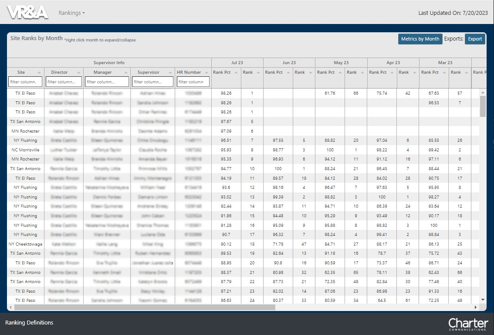

# Employee Ranking Web and Database Application

## 
VR Ranking Project

**The Opportunity**: Every month employees are offered the chance to change their work schedule. These opportunities are offerd based on performance.

**The Solution**: Build out a single system which houses all the ranking results, and build out the data base processes that keep that data updated.

**The Enhancements**: This project quickly turned into making daily updates thus allowing employees to guage where their performnace is at.

### Links, IPs, Paths, basically anything identifiable and unique to the workplace has been edited out.
